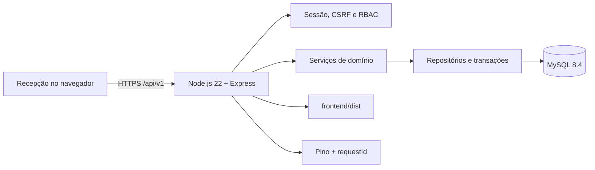
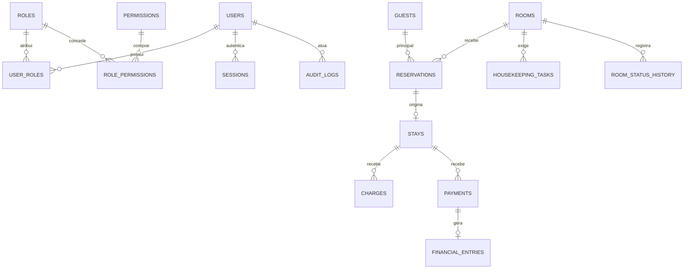

# Arquitetura

O frontend e o backend são aplicações separadas no código. O navegador consome somente a API; regras críticas, dinheiro, concorrência, autorização e auditoria ficam no backend. Em produção, o Express serve o build Vite no mesmo domínio.

| Camada         | Local                     | Responsabilidade                             |
| -------------- | ------------------------- | -------------------------------------------- |
| Interface      | `frontend/src/`           | HTML semântico, CSS, estado e serviços HTTP. |
| HTTP           | `backend/src/routes/v1/`  | Contratos Zod, autenticação e permissões.    |
| Domínio        | `backend/src/services/`   | Reservas, estadias, limpeza e finanças.      |
| Dados          | `backend/src/db/`         | Pool, repositórios, migrations e seed.       |
| Infraestrutura | `config/`, `middlewares/` | Ambiente, logs, erros, CSRF e rate limit.    |

Dinheiro usa inteiros em centavos. Datas hoteleiras usam `DATE`; eventos usam UTC e são apresentados em `America/Sao_Paulo`. Agregados críticos usam versão e locks transacionais.
